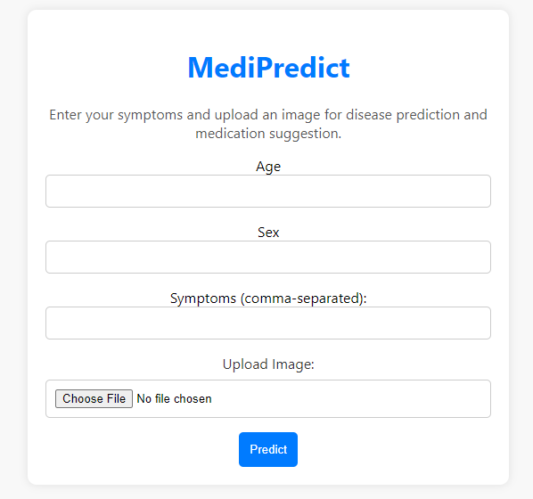
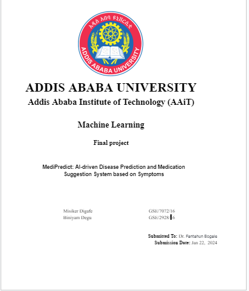

**MediPredict: AI-driven Disease Prediction and Medication Suggestion System based on Symptoms**
MediPredict is an innovative AI-driven system designed to predict diseases and suggest medications based on symptoms. Leveraging advanced machine learning algorithms and natural language processing, the system aims to revolutionize healthcare by providing accurate and timely predictions, ultimately improving patient outcomes and reducing the burden on healthcare professionals.

**NOTE:** ***This project is for demo(class assignment) purposes only. For any symptoms/disease, please refer to a Doctor.***

